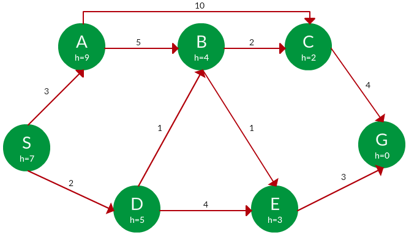

# Searching-Algorithm

## Given data
    # of nodes = 9
    edges = [[1, 4], [1, 8], [2, 7], [2, 9], [3, 3], [5, 6], [5, 7], [5, 9], [7, 9]]

#### Adjacency List

https://train.usaco.org/usacotext2?a=j3y9xVjsttL&S=graph

    [[], [4, 8], [7, 9], [3, 3], [1], [6, 7, 9], [5], [2, 5, 9], [1], [2, 5, 7]]
    {1: [4, 8], 2: [7, 9], 3: [3, 3], 4: [1], 5: [6, 7, 9], 6: [5], 7: [2, 5, 9], 8: [1], 9: [2, 5, 7]}

## Flood fill

https://train.usaco.org/usacotext2?a=j3y9xVjsttL&S=flood

    [0, 1, 2, 3, 1, 2, 2, 2, 1, 2]  # [0] is dummy

### UCS

### Greedy Search

### A* Search

